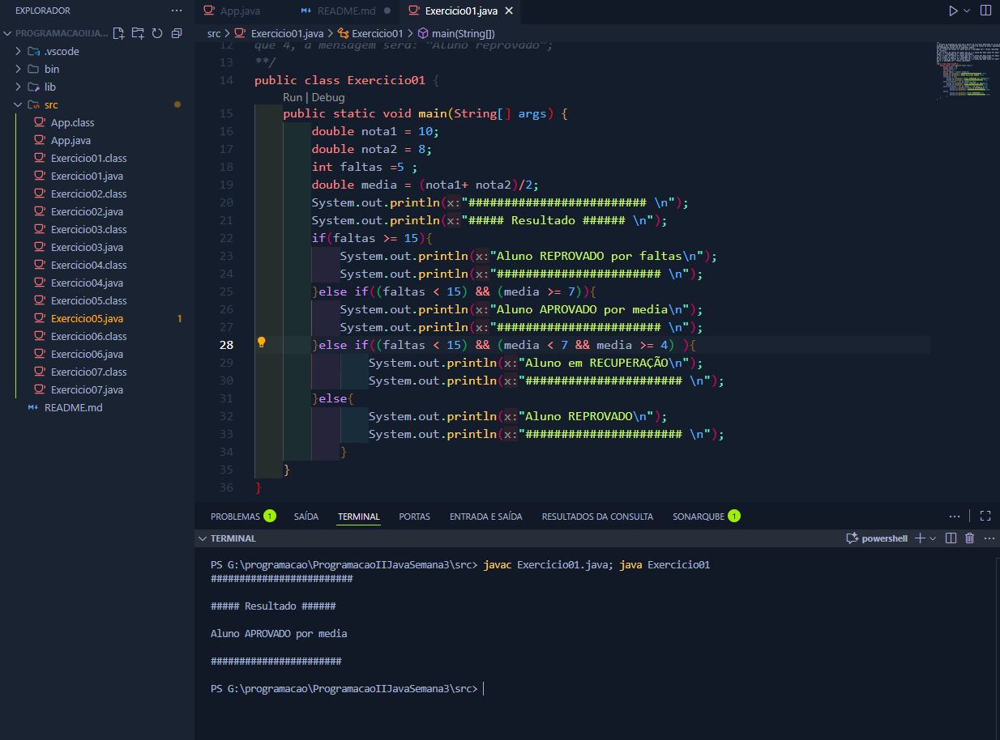
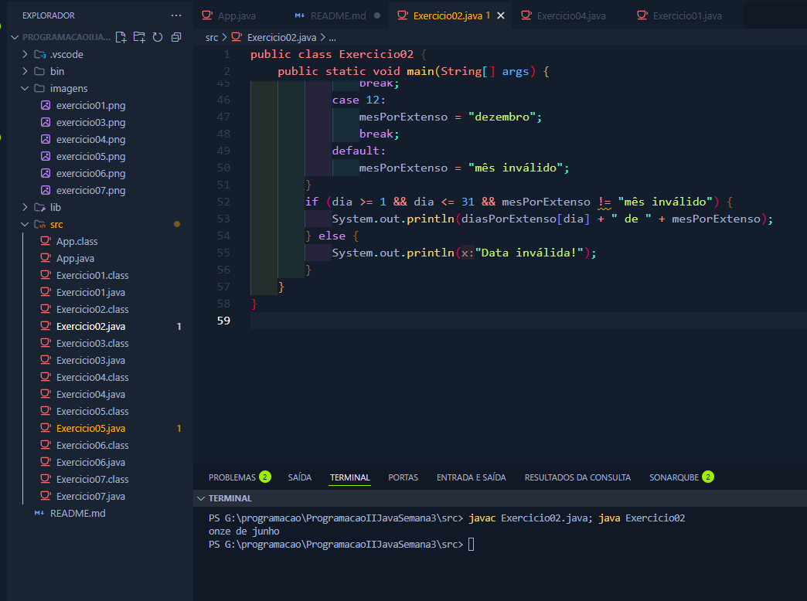
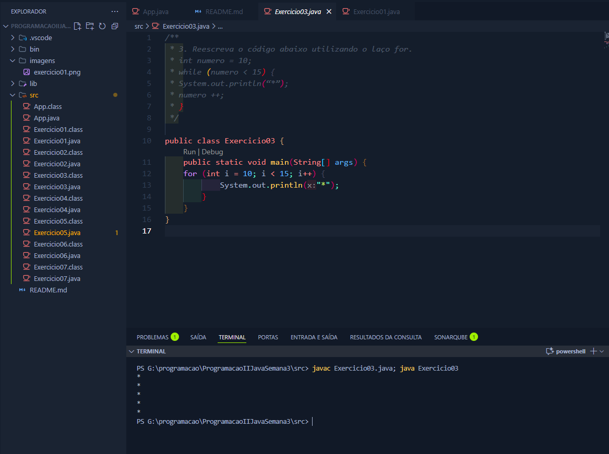
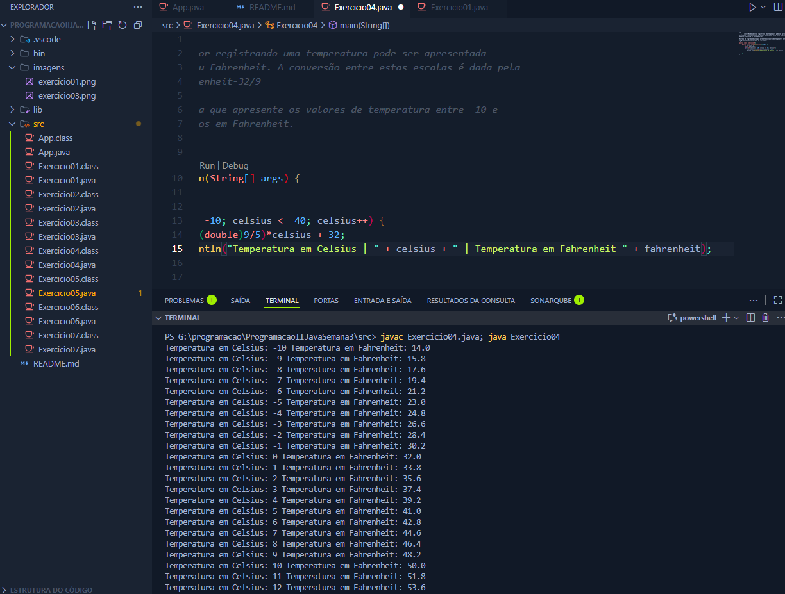
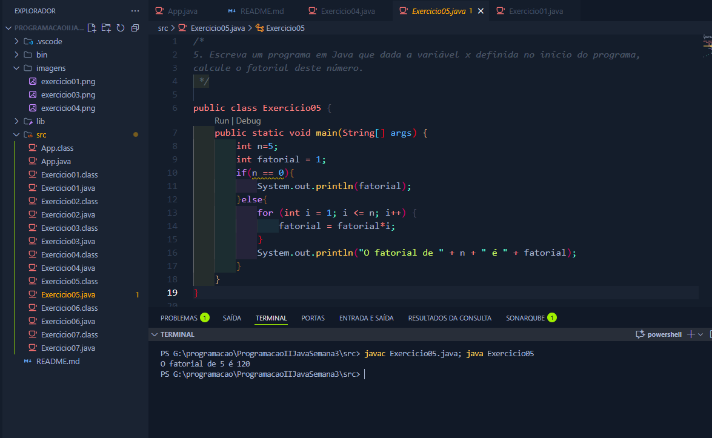
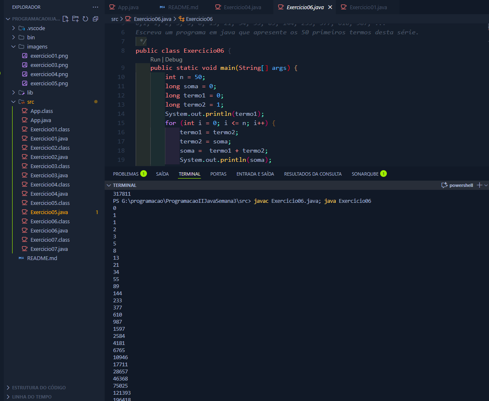
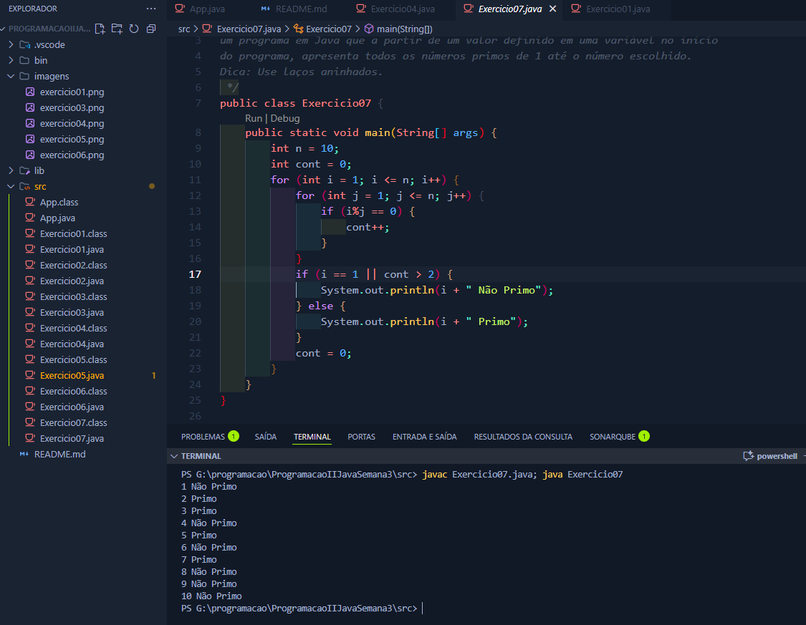

# Programação II - Exercícios Capítulo 2 (Volume 2) - UFRPE EAD

Este projeto reúne os exercícios do Capítulo 2(Operadores e Controles de
Fluxo) do Volume 2 da apostila da disciplina de Programação II, do curso de Bacharelado em Sistemas de Informação (EAD) da UFRPE.

Cada exercício foi implementado em uma classe Java separada, com um menu principal para facilitar a execução. O objetivo é aplicar e fixar os conceitos estudados no capítulo.

## Estrutura do Projeto

- `App.java`: Menu principal para acessar cada exercício.
- `Exercicio01.java` a `Exercicio07.java`: Implementações dos exercícios propostos.

## Exercícios

### Exercício 01

**Descrição:** Verifica a situação de um aluno (aprovado, reprovado por faltas, recuperação) com base em notas e faltas.

**Resultado:**



---

### Exercício 02

**Descrição:** Escreve a data por extenso a partir de variáveis inteiras para dia e mês, convertendo o número do mês para texto usando switch/case. Exemplo: se dia = 11 e mês = 6, a saída será “onze de junho”

**Resultado:**



---

### Exercício 03

**Descrição:** Reescrever o código indicado no exercício, que originalmente utiliza o laço de repetição switch, agora utilizando o laço for.

**Resultado:**



---

### Exercício 04

**Descrição:** Converte e exibe os valores de temperatura de -10 a 40 graus Celsius para Fahrenheit, utilizando a fórmula de conversão entre as duas escalas. O programa apresenta cada valor em Celsius e seu correspondente em Fahrenheit.

**Resultado:**



---

### Exercício 05

**Descrição:** Calcula o fatorial de um número inteiro definido em uma variável no início do programa, utilizando um laço para multiplicar todos os valores de 1 até o número informado. O resultado é exibido na tela.

**Resultado:**



---

### Exercício 06

**Descrição:** Gera e exibe os 50 primeiros termos da série de Fibonacci, onde cada termo (a partir do terceiro) é a soma dos dois anteriores, começando por 0 e 1. O programa mostra a sequência completa na tela.

**Resultado:**



---

### Exercício 07

**Descrição:** Identifica e exibe todos os números primos de 1 até um valor definido em uma variável, utilizando laços aninhados para verificar a quantidade de divisores de cada número. O programa informa se cada número é primo ou não.

**Resultado:**



---


## Como baixar e executar o projeto

### 1. Clonar o repositório

No terminal, execute:

```sh
git clone https://github.com/lipeqalves/java-exercicios-ufrpe-vol2-cap2.git
```

Depois, acesse a pasta do projeto:

```sh
cd java-exercicios-ufrpe-vol2-cap2
```

### 2. Compilar e executar o App.java

Entre na pasta `src`:

```sh
cd src
```

Compile o arquivo principal:

```sh
javac App.java
```

Execute o programa:

```sh
java App
```

Assim, o menu será exibido e você poderá escolher qual exercício rodar.


#### Exemplo do menu exibido

```text
===== MENU DE EXERCÍCIOS =====
1 - Exercício 01
2 - Exercício 02
3 - Exercício 03
4 - Exercício 04
5 - Exercício 05
6 - Exercício 06
7 - Exercício 07
0 - Sair
Escolha uma opção:
```

### Opção alternativa: Executando cada exercício separadamente

1. Abra o terminal e navegue até a pasta `src` do projeto.

2. Compile a classe desejada, por exemplo:

```sh
javac Exercicio03.java
```

3. Execute a classe compilada:

```sh
java Exercicio03
```

4. Repita para qualquer outro exercício, trocando o nome da classe conforme necessário.

---

Projeto desenvolvido para fins acadêmicos - UFRPE EAD
